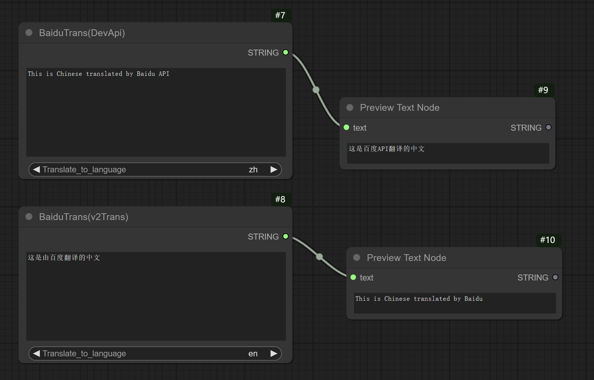

# ComfyUI_BaiduTranslate  
ComfyUI下使用的中英文文本翻译插件。  

  

### 插件调整项：  
**Translate_to_language：** 翻译目标语言。en是英语，zh是简体中文。  

## 节点说明：  
有两个节点可供使用，区别是使用了不同的翻译接口。  
### BaiduTrans(use DevApi):  
使用百度翻译个人开发者apiid及密钥，每月100万字符免费额度。  
需要在[https://fanyi-api.baidu.com/](https://fanyi-api.baidu.com/) 免费申请成为开发者，并在控制台开通高级版即可使用，你将获得一个APIid和对应的密钥。  
然后用文本编辑软件打开baidu_devapi.json，在冒号:后面的引号""内分别填入你的appid和密钥，保存文件。重启ComfyUI生效。 

### BaiduTrans(v2trans)：  
从百度翻译https公共接口用爬虫获取翻译结果。这个接口不太稳定，对于中英文混合文本的翻译支持不好。所以做了一些判断来避免发生返回错误。  
当目标语言设置为英语时，如果返回内容包含中文，则直接返回原文。当目标语言为中文时，如果返回内容不包含中文，亦直接返回原文。  
注意，这个节点偶尔出现英译中长句返回空结果的问题，这并不是本插件的问题所导致。  

## 安装方法：  
- 解压zip文件，将"ComfyUI_BaiduTranslate"文件夹复制到 ComfyUI\custom_nodes\  
- 安装依赖包，在资源管理器ComfyUI\custom_nodes\ComfyUI_BaiduTranslate\ 这个位置打开cmd窗口，输入以下命令：  
```..\..\..\python_embeded\python.exe -s -m pip install -r requirements.txt```  
- 重新打开ComfyUI  

## 使用方法：  
- 在节点文本框输入中文或英文，下面“Translate_to_language”选择要翻译的目标语言。  
- 如需预览文本，可后面接一个“Preview Text Node”，这个节点在[ComfyUI_Custom_Nodes_AlekPet](https://github.com/AlekPet/ComfyUI_Custom_Nodes_AlekPet)

